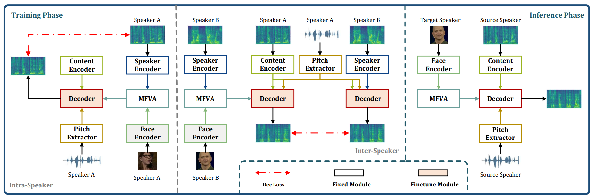

<!-- ## Abstract -->

**Abstract**: This paper proposes a novel task, zero-shot voice conversion based on the face image (zero-shot FaceVC), which allows for converting the voice characteristic of an utterance from any source speakers to a newly coming target speaker, solely relying on a single face image of the target speaker. To address this task, we introduce a face-voice memory based zero-shot FaceVC method. Our approach leverages a memory based face-voice alignment module, where slots act as the bridge to align these two modalities, allowing for the capture of voice characteristic information from the face image. In this method, a mixed supervision strategy is also introduced to mitigate the long-standing issue of inconsistency between training and inference phases for voice conversion tasks. To obtain speaker-independent content-related representation, we transfer the knowledge from the pretrained zero-shot voice conversion model to zero-shot FaceVC model. In response to the unique challenges posed by this task as compared to traditional voice conversion tasks, we have developed a range of  subjective and objective metrics to thoroughly evaluate our method. These metrics primarily focus on assessing  homogeneity, diversity and consistency of voice characteristic controlled by the face image. Through extensive experiments, we demonstrate the superiority of our proposed method on this novel task. 

## Offical Code Github REPO

The code will be available soon

## Audio Samples

1. The converted utterances by SpeechVC and FVMVC are presented in the fifth row. SpeechVC used the natural reference utterance of the target speaker, presented in the third row, while FVMVC relied on the face image of the target speaker, presented in the second row. The source utterance of the source speaker is presented in the third row..

    <table align = "center" style="text-align: center;">

    <tr>
    <th style="text-align: center;">Source speaker </th>
    <th style="text-align: center;">Target Speaker</th>
    </tr>

    <tr>
    <td></td>
    <td></td>
    </tr>

    <tr>
    <td><audio controls="" ><source src="resources/wav/1/ref_sour_wav/7kkR_00003_mgcj_00008_M2F_src_gen.wav" type="audio/wav"></audio></td>
    <td><audio controls=""><source src="resources/wav/1/ref_sour_wav/7kkR_00003_mgcj_00008_M2F_ref_gen.wav" type="audio/wav"></audio></td>
    </tr>

    <tr>
    <th style="text-align: center;">SpeechVC</th>
    <th style="text-align: center;">FVMVC</th>
    </tr>
    <tbody>
    <tr>
    <td><audio controls="" ><source src="resources/wav/1/SpeechVC/7kkR_00003_mgcj_00008_M2F_gen.wav" type="audio/wav"></audio></td>
    <td><audio controls="" ><source src="resources/wav/1/FVMVC/7kkR_00003_mgcj_00008_M2F_gen.wav"  type="audio/wav"></audio></td>
    </tr>
    </tbody>
    </table>
     

    <table align = "center"  style="text-align: center;">

    <tr>
    <th style="text-align: center;">Source Speaker</th>
    <th style="text-align: center;">Target Speaker</th>
    </tr>

    <tr>
    <td></td>
    <td></td>
    </tr>

    <tr>
    <td><audio controls="" ><source src="resources/wav/1/ref_sour_wav/9uOM_00001_ZJNE_00047_F2M_src_gen.wav" type="audio/wav"></audio></td>
    <td><audio controls=""><source src="resources/wav/1/ref_sour_wav/9uOM_00001_ZJNE_00047_F2M_ref_gen.wav"></audio></td>
    </tr>

    <tr>
    <th style="text-align: center;">SpeechVC</th>
    <th style="text-align: center;">FVMVC</th>
    </tr>
    <tbody>
    <tr>
    <td><audio controls="" ><source src="resources/wav/1/SpeechVC/9uOM_00001_ZJNE_00047_F2M_gen.wav" type="audio/wav"></audio></td>
    <td><audio controls="" ><source src="resources/wav/1/FVMVC/9uOM_00001_ZJNE_00047_F2M_gen.wav"  type="audio/wav"></audio></td>
    </tr>
    </tbody>
    </table>

     
    <table align = "center" style="text-align: center;">

    <tr>
    <th style="text-align: center;">Source Speaker</th>
    <th style="text-align: center;">Target Speaker</th>
    </tr>

    <tr>
    <td></td>
    <td></td>
    </tr>

    <tr>
    <td><audio controls="" ><source src="resources/wav/1/ref_sour_wav/81Ub_00003_UAj1_00011_F2M_src_gen.wav" type="audio/wav"></audio></td>
    <td><audio controls=""><source src="resources/wav/1/ref_sour_wav/81Ub_00003_UAj1_00011_F2M_ref_gen.wav"></audio></td>
    </tr>

    <tr>
    <th style="text-align: center;">SpeechVC</th>
    <th style="text-align: center;">FVMVC</th>
    </tr>
    <tbody>
    <tr>
    <td><audio controls="" ><source src="resources/wav/1/SpeechVC/81Ub_00003_UAj1_00011_F2M_gen.wav" type="audio/wav"></audio></td>
    <td><audio controls="" ><source src="resources/wav/1/FVMVC/81Ub_00003_UAj1_00011_F2M_gen.wav"  type="audio/wav"></audio></td>
    </tr>
    </tbody>
    </table>

2. Converted utterances by the different face images of the same target speaker. 
    <table stype='width:80%' style="text-align: center;">

    <tr>
    <th style="text-align: center;">Source Speaker</th>
    <th style="text-align: center;">Target Speaker Image1</th>
    <th style="text-align: center;">Target Speaker Image2</th>
    <th style="text-align: center;">Target Speaker Image3</th>
    </tr>

    <tr>
    <td></td>
    <td></td>
    <td></td>
    <td></td>
    </tr>

    <tr>
    <td><audio controls="" ><source src="resources/wav/2/ref_sour_wav/81Ub_00001_mgcj_00008_M2M_src_gen.wav" type="audio/wav"></audio></td>
    <td><audio controls="" ><source src="resources/wav/2/FVMVC/81Ub_00001_mgcj_00008_M2M_gen.wav" type="audio/wav"></audio></td>
    <td><audio controls="" ><source src="resources/wav/2/FVMVC/81Ub_00002_mgcj_00008_M2M_gen.wav" type="audio/wav"></audio></td>
    <td><audio controls="" ><source src="resources/wav/2/FVMVC/81Ub_00003_mgcj_00008_M2M_gen.wav" type="audio/wav"></audio></td>
    </tr>

    <tr>
    <td><audio controls="" ><source src="resources/wav/2/ref_sour_wav/81Ub_00001_mgcj_00015_M2M_gen.wav" type="audio/wav"></audio></td>
    <td><audio controls="" ><source src="resources/wav/2/FVMVC/81Ub_00001_mgcj_00015_M2M_gen.wav" type="audio/wav"></audio></td>
    <td><audio controls="" ><source src="resources/wav/2/FVMVC/81Ub_00002_mgcj_00015_M2M_gen.wav" type="audio/wav"></audio></td>
    <td><audio controls="" ><source src="resources/wav/2/FVMVC/81Ub_00003_mgcj_00015_M2M_gen.wav" type="audio/wav"></audio></td>
    </tr>

    <tr>
    <td><audio controls="" ><source src="resources/wav/2/ref_sour_wav/81Ub_00001_mgcj_00002_M2M_src_gen.wav" type="audio/wav"></audio></td>
    <td><audio controls="" ><source src="resources/wav/2/FVMVC/81Ub_00001_mgcj_00002_M2M_gen.wav" type="audio/wav"></audio></td>
    <td><audio controls="" ><source src="resources/wav/2/FVMVC/81Ub_00002_mgcj_00002_M2M_gen.wav" type="audio/wav"></audio></td>
    <td><audio controls="" ><source src="resources/wav/2/FVMVC/81Ub_00003_mgcj_00002_M2M_gen.wav" type="audio/wav"></audio></td>
    </tr>
    </table>

     

    <table stype='width:80%' style="text-align: center;">

    <tr>
    <th style="text-align: center;">Source Speaker</th>
    <th style="text-align: center;">Target Speaker Image1</th>
    <th style="text-align: center;">Target Speaker Image2</th>
    <th style="text-align: center;">Target Speaker Image3</th>
    </tr>

    <tr>
    <td></td>
    <td></td>
    <td></td>
    <td></td>
    </tr>

    <tr>
    <td><audio controls="" ><source src="resources/wav/2/ref_sour_wav/YzGj_00005_mgcj_00008_M2F_src_gen.wav" type="audio/wav"></audio></td>
    <td><audio controls="" ><source src="resources/wav/2/FVMVC/YzGj_00005_mgcj_00008_M2F_gen.wav" type="audio/wav"></audio></td>
    <td><audio controls="" ><source src="resources/wav/2/FVMVC/YzGj_00006_mgcj_00008_M2F_gen.wav" type="audio/wav"></audio></td>
    <td><audio controls="" ><source src="resources/wav/2/FVMVC/YzGj_00013_mgcj_00008_M2F_gen.wav" type="audio/wav"></audio></td>
    </tr>

    <tr>
    <td><audio controls="" ><source src="resources/wav/2/ref_sour_wav/YzGj_00005_xTkK_00004_M2F_src_gen.wav" type="audio/wav"></audio></td>
    <td><audio controls="" ><source src="resources/wav/2/FVMVC/YzGj_00005_mgcj_00015_M2F_gen.wav" type="audio/wav"></audio></td>
    <td><audio controls="" ><source src="resources/wav/2/FVMVC/YzGj_00006_mgcj_00015_M2F_gen.wav" type="audio/wav"></audio></td>
    <td><audio controls="" ><source src="resources/wav/2/FVMVC/YzGj_00013_mgcj_00015_M2F_gen.wav" type="audio/wav"></audio></td>
    </tr>

    <tr>
    <td><audio controls="" ><source src="resources/wav/2/ref_sour_wav/YzGj_00005_mgcj_00002_M2F_src_gen.wav" type="audio/wav"></audio></td>
    <td><audio controls="" ><source src="resources/wav/2/FVMVC/YzGj_00005_mgcj_00002_M2F_gen.wav" type="audio/wav"></audio></td>
    <td><audio controls="" ><source src="resources/wav/2/FVMVC/YzGj_00006_mgcj_00002_M2F_gen.wav" type="audio/wav"></audio></td>
    <td><audio controls="" ><source src="resources/wav/2/FVMVC/YzGj_00013_mgcj_00002_M2F_gen.wav" type="audio/wav"></audio></td>
    </tr>
    </table>

3. Voice interpolation.
    <table stype='width:80%' style="text-align: center;">

    <tr>
    <th></th>
    <th style="text-align: center;">Speaker A</th>
    <th style="text-align: center;">Speaker B</th>
    <th></th>
    <th style="text-align: center;">Speaker C</th>
    <th style="text-align: center;">Speaker D</th>
    <th></th>
    <th style="text-align: center;">Speaker E</th>
    <th style="text-align: center;">Speaker F</th>
    </tr>

    <tr>
    <td></td>
    <td></td>
    <td></td>
    <td></td>
    <td></td>
    <td></td>
    <td></td>
    <td></td>
    <td></td>
    </tr>

    <tr>
    <td>A</td>
    <td colspan ="2" ><audio controls="" ><source src="resources/wav/3/9uOM_7kkR/mgcj_00002_0.0_gen.wav" type="audio/wav"></audio></td>
    <td>C</td>
    <td colspan ="2" ><audio controls="" ><source src="resources/wav/3/81Ub_E22i/mgcj_00008_0.0_gen.wav" type="audio/wav"></audio></td>
    <td>E</td>
    <td colspan ="2" ><audio controls="" ><source src="resources/wav/3/FFG2_hilc/mgcj_00013_0.0_gen.wav" type="audio/wav"></audio></td>
    </tr>
  

    <tr>
    <td>0.6A+0.4B</td>
    <td colspan ="2" ><audio controls="" ><source src="resources/wav/3/9uOM_7kkR/mgcj_00002_0.3_gen.wav" type="audio/wav"></audio></td>
    <td>0.6C+0.4D</td>
    <td colspan ="2" ><audio controls="" ><source src="resources/wav/3/81Ub_E22i/mgcj_00008_0.4_gen.wav"  type="audio/wav"></audio></td>
    <td>0.6E+0.4F</td>
    <td colspan ="2" ><audio controls="" ><source src="resources/wav/3/FFG2_hilc/mgcj_00013_0.2_gen.wav" type="audio/wav"></audio></td>
    </tr>
  

    <tr>
    <td>0.4A+0.6B</td>
    <td colspan ="2" ><audio controls="" ><source src="resources/wav/3/9uOM_7kkR/mgcj_00002_0.7_gen.wav" type="audio/wav"></audio></td>
    <td>0.4C+0.6D</td>
    <td colspan ="2" ><audio controls="" ><source src="resources/wav/3/81Ub_E22i/mgcj_00008_0.5_gen.wav"  type="audio/wav"></audio></td>
    <td>0.4E+0.6F</td>
    <td colspan ="2" ><audio controls="" ><source src="resources/wav/3/FFG2_hilc/mgcj_00013_0.7_gen.wav" type="audio/wav"></audio></td>
    </tr>

    <tr>
    <td>B</td>
    <td colspan ="2" ><audio controls="" ><source src="resources/wav/3/9uOM_7kkR/mgcj_00002_1.0_gen.wav" type="audio/wav"></audio></td>
    <td>D</td>
    <td colspan ="2" ><audio controls="" ><source src="resources/wav/3/81Ub_E22i/mgcj_00008_1.0_gen.wav"  type="audio/wav"></audio></td>
    <td>F</td>
    <td colspan ="2" ><audio controls="" ><source src="resources/wav/3/FFG2_hilc/mgcj_00013_1.0_gen.wav" type="audio/wav"></audio></td>
    </tr>
    </table>